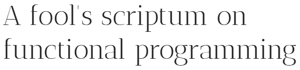

   

## What

scriptum is a no-frills functional programming library and a learning course based on it.

## Status

The chapters of this online course are under continuous change as my knowledge and experience grows. The scriptum library is still experimental and not meant for production code.

## Functional programming course (TOC)

### Part I (untyped)

01. [Functional Jargon and Programmer Experience](https://github.com/kongware/scriptum/blob/master/course/ch-001.md)
02. [Managing State in Functional Programming](https://github.com/kongware/scriptum/blob/master/course/ch-002.md)
03. [Currying, Composition and Point-free Style](https://github.com/kongware/scriptum/blob/master/course/ch-003.md)
04. [Principled and Unprincipled Abstractions](https://github.com/kongware/scriptum/blob/master/course/ch-004.md)
05. [Data Modeling with Algebraic Data Types (ADTs)](https://github.com/kongware/scriptum/blob/master/course/ch-005.md)
06. [Lazy Evaluation on Demand](https://github.com/kongware/scriptum/blob/master/course/ch-006.md) [updated]
07. [Linear Data Flow and Flat Composition Syntax](https://github.com/kongware/scriptum/blob/master/course/ch-007.md)
08. [From Recursion to Corecursion](https://github.com/kongware/scriptum/blob/master/course/ch-008.md) [updated]
09. [Trading Stack for Heap with Trampolines](https://github.com/kongware/scriptum/blob/master/course/ch-009.md)
10. [Loop Fusion and Data Source Abstraction with Transducers](https://github.com/kongware/scriptum/blob/master/course/ch-010.md)
11. [Immutability in Languages w/o Purely Functional Data Types](https://github.com/kongware/scriptum/blob/master/course/ch-011.md)
12. [A Little Type Theory](https://github.com/kongware/scriptum/blob/master/course/ch-012.md)
13. [Type class polymorphism through dictionary passing style](https://github.com/kongware/scriptum/blob/master/course/ch-013.md)
14. [Lifting Pure Functions using Functor](https://github.com/kongware/scriptum/blob/master/course/ch-014.md)
15. [Accumulating, Aggregating and Picking with Monoid](https://github.com/kongware/scriptum/blob/master/course/ch-015.md)
16. [Combining Effects with Pure Functions using Applicative](https://github.com/kongware/scriptum/blob/master/course/ch-016.md)
17. Planned: Combining Effects with Actions using Monad (▓▓▓▓▓▓░░░░ 60% done)
18. Planned: Composing Different Effects with Monad Transformers (░░░░░░░░░░ 0% done)
19. [Respecting the Structure with Natural Transformations](https://github.com/kongware/scriptum/blob/master/course/ch-019.md) [needs edit]

## Why

Functional programming comes from math and has therefore the most solid theoretically foundation of all paradigms. Functional programming...

* is based on a couple of recurring general patterns from math
* renders certain aspects of your code explicit
* strives for a high level of abstraction 

These three traits have a huge impact on how you write and reason about programs. The first point leads to highly predictable code, because the underlying patterns are always the same. These patterns are so general that they have a wide range of applications. You can plug code together and there is a good chance that it just works as expected.

No one made these patterns up but they come from math. Mathematical concepts and structures tend to be very formal and often rather non-intuitive. This is the hardest part of functional programming. You need to let go your intuition in order to be open minded towards the mathematical ideas.

The second point makes functional programming tedious sometimes, because it forces you to make certain effects in your program explicit throughout your codebase. This makes the process of creating an application hard at the beginning but it results in reliable and resilient code down the road.

The third point enables code reuse, not only as a nice theoretical idea but in practice to an extent that you have never experienced before.

## Who

This course addresses both functional programming novices and experienced imperative programmers. In both cases you need to develop a completely new intuition about programming. This can be frustrating and confusing at first. Hang in there!

## How

scriptum is the attempt to get as close as possible to the functional paradigm by using a multi paradigm language that many developer are familiar with. The main goal is to be language agnostic so that you can transfer the acquired knowledge to your preferred language.

As it turns out all we need to get there...

* are first class functions
* is a mechanism to allow expressions to be in weak head normal form

It is remarkable how many purely functional idioms we can express with these two features.

I will not get particularly academic, that is to say I will forgo equational reasoning or mathematical proofs with cryptic symbols from intuitionistic logic. There are plenty of outstanding academic papers and other sources out there, which do a great job conveying knowledge in a rather formal way. Instead I will attempt to let you develop an intuition by mainly using natural language, code examples and type annotations. Natural language can be surprisingly accurate, as soon as we share a common terminology and avoid fuzzy metaphors as often as possible.

The 1st part of the course will be kept in an untyped and yet type directed setting. This way we can focus on the functional idioms without being distracted from a type machinery. In the 2nd part we will learn about parametric and ad-hoc polymorphism, higher kinded and higher ranked types and how we can express them with Typescript's structural type system.

## Contribution

Please report an issue if you run across a mistake, ambiguous wording or inconsistent statement in the course. Please let me also know if there is an important subject missing in the chapter pipeline. Your help is much appreciated!

## Controversial decisions

### No external dependencies or preprocessors

This course is meant to lower the threshold for imperative programmers and functional novices to become familiar with the paradigm. Consequently the underlying library solely depends on vanilla Javascript without any external dependencies or additional compiling steps.

### No language specific idioms

I want scriptum to be as simple and as general as possible without any Javascript specific idioms. Hence I don't rely on the prototype system and rarely use method chaining.

### Curried functions only

scriptum relies on curried functions. Currying isn't a prerequisite of functional programming but helps simplifying the function interface. However, for performance reasons I will sporadically use local multi-parameter functions in a recursive context, where large amounts of data are processed.

### Mixed Im-/mutability

Javascript's plain old `Object` type along with functional optics leans itself quite naturally to immutability and is hence treated as such. However, `Array`, `Map`, `Set` et al. are designed for a mutable setting. Treat them as immutable leads to rather inefficient code. If you work with scriptum it is your responsibility as a developer to copy such values before performing destructive updates.

## TODO

* Planned: Functorial Loop Fusion with Co-/Yoneda
* Planned: Extracing values with Comonad
* Planned: The Runtime - Outer Rim of your Application
* Planned: CPS Transformation for Stack-safe Recursion
* Planned: Delimited Continuations and Coroutines
* Planned: From Sharing to Memoization
* Planned: Functional Encoded State Machines
* Planned: Mastering Tree Data Structures
* Planned: Generalizing Folds and Unfolds with Recursion Schemes
* Planned: Streams: Push/Pull, In-/Finite, Uni-/Multicast, Sync/Async
* Planned: Functional Error Handling and Debugging
* Planned: Safely Using Imperative Iterators
* Planned: Multi-Parameter Type Classes and Functional Dependencies
* Planned: List-Comprehension and its extension for other data types
* Planned: Random Access, Single Linked and Difference Lists
* Planned: Functional Iso (Optics)
* Planned: Functional Lenses (Optics)
* Planned: Functional Prism (Optics)
* Planned: Functional Optional (Optics)
* Planned: Functional Traversals (Optics)
* Planned: Functional Getters (Optics)
* Planned: Functional Setters (Optics)
* Planned: Functional Folds (Optics)
* Planned: Free Monads - Normal Style, CPS, Codensity, Reflection
* Planned: Freer Monads and Extensible Effects
* Planned: Tagless Final Encoding
* Planned: Functional Architectures
* Planned: Type-Directed Programming
* Planned: When FP does not save us
* Planned: Incremental computing
* Planned: Functional Reactive Programming
* Planned: Event Sourcing and Stores
* Planned: Conflict-free Replicated Data Types
* Planned: Common Type Class: `Alt<T>`
* Planned: Common Type Class: `Alternative<T>`
* Planned: Common Type Class: `Applicative<F>`
* Planned: Common Type Class: `Apply<F>`
* Planned: Common Type Class: `Behavior<A, E>`
* Planned: Common Type Class: `Bifunctor<T>`
* Planned: Common Type Class: `Bounded<T>`
* Planned: Common Type Class: `Category<T>`
* Planned: Common Type Class: `Chain<T>`
* Planned: Common Type Class: `Clonable<T>`
* Planned: Common Type Class: `Comonad<W>`
* Planned: Common Type Class: `Contravariant<T>`
* Planned: Common Type Class: `Distributive<F>`
* Planned: Common Type Class: `Enum<T>`
* Planned: Common Type Class: `Extend<W>`
* Planned: Common Type Class: `Foldable<T>`
* Planned: Common Type Class: `Functor<F>`
* Planned: Common Type Class: `Filterable<T>`
* Planned: Common Type Class: `Functor<F>`
* Planned: Common Type Class: `Group<T>`
* Planned: Common Type Class: `Ix<T>`
* Planned: Common Type Class: `IxMonad<M>`
* Planned: Common Type Class: `Monad<M>`
* Planned: Common Type Class: `Monoid<M>`
* Planned: Common Type Class: `Observable<A, E>`
* Planned: Common Type Class: `Ord<T>`
* Planned: Common Type Class: `Partial<T>`
* Planned: Common Type Class: `Plus<T>`
* Planned: Common Type Class: `Profunctor<T>`
* Planned: Common Type Class: `Representable<F>`
* Planned: Common Type Class: `Semigroup<T>`
* Planned: Common Type Class: `Semigroupoid<T>`
* Planned: Common Type Class: `Serializable<T>`
* Planned: Common Type Class: `Setoid<T>`
* Planned: Common Type Class: `Traversable<T>`
* Planned: Common Type Class: `Unfoldable<T>`
* Planned: Common Type Class: `Unserializable<T>`
* Planned: Common Functional Type: `All`
* Planned: Common Functional Type: `Any`
* Planned: Common Functional Type: `Comparator`
* Planned: Common Functional Type: `Compare<A>`
* Planned: Common Functional Type: `Compose<F, G, A>`
* Planned: Common Functional Type: `Const<A, B>`
* Planned: Common Functional Type: `Cont<K>`
* Planned: Common Functional Type: `Contrvaraint<F>`
* Planned: Common Functional Type: `Effect<A>`
* Planned: Common Functional Type: `Either<A, B>`
* Planned: Common Functional Type: `Endo<A>`
* Planned: Common Functional Type: `Equiv<F>`
* Planned: Common Functional Type: `First<A>`
* Planned: Common Functional Type: `Id<A>`
* Planned: Common Functional Type: `Invariant<F>`
* Planned: Common Functional Type: `Last<A>`
* Planned: Common Functional Type: `Lazy<F>`
* Planned: Common Functional Type: `List<A>`
* Planned: Common Functional Type: `Max<A>`
* Planned: Common Functional Type: `Min<A>`
* Planned: Common Functional Type: `Option<A>`
* Planned: Common Functional Type: `Pair<A, B>`
* Planned: Common Functional Type: `Parallel<F>`
* Planned: Common Functional Type: `Pred<A>`
* Planned: Common Functional Type: `Product<A>`
* Planned: Common Functional Type: `Record<R>`
* Planned: Common Functional Type: `Ref<A>`
* Planned: Common Functional Type: `ST<S, A>`
* Planned: Common Functional Type: `Stream<A>`
* Planned: Common Functional Type: `Sum<A>`
* Planned: Common Functional Type: `Task<F>`
* Planned: Common Functional Type: `These<A, B>`
* Planned: Common Functional Type: `Triple<A, B, C>`
* Planned: Common Functional Type: `Validate<E, A>`
* Planned: Common Functional Type: `ValueObj<K, V>`
